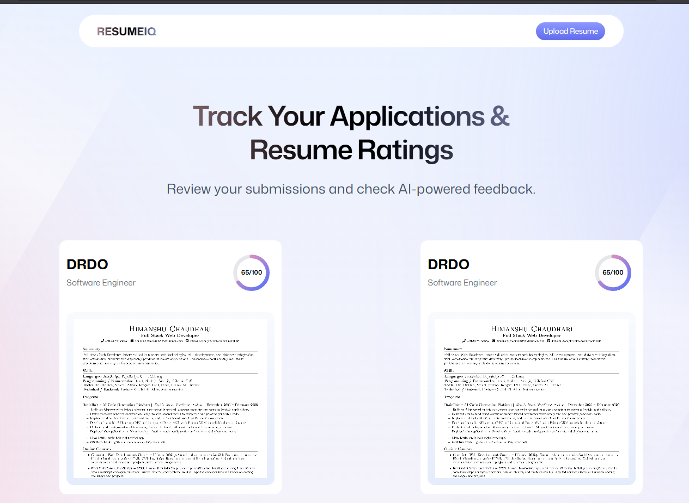

<div align="center">
  

  <br />
  <br />

  <h1>🚀 AI Resume Analyzer</h1>
  
  <p>
    <strong>Smart feedback for your dream job. Get an ATS score and improvement tips instantly.</strong>
  </p>
</div>

---

## 📖 Overview

**AI Resume Analyzer** is a modern, full-stack application that leverages Artificial Intelligence to analyze resumes against specific job descriptions. Built with React Router v7 and Puter.js, this tool provides instant Applicant Tracking System (ATS) scoring, comprehensive feedback, and actionable tips to help job seekers land their dream roles.

## ✨ Features

- **📄 PDF to Image Conversion:** Seamlessly uploads and processes PDF resumes.
- **🤖 AI-Powered Analysis:** Analyzes your resume contextually against the target company and job description.
- **🎯 ATS Scoring:** Provides an estimated ATS match score.
- **💡 Smart Feedback:** Generates tailored, actionable improvement tips.
- **⚡ Backendless Architecture:** Powered entirely by [Puter.js](https://puter.com/) for Cloud Storage, Key-Value Database, and AI Inference.
- **🎨 Modern UI:** Sleek, responsive design built with Tailwind CSS v4 and Framer Motion.

---

## 💻 Tech Stack

| Category | Technologies |
|---|---|
| **Framework** | [React Router v7](https://reactrouter.com/) |
| **Language** | [TypeScript](https://www.typescriptlang.org/) |
| **Styling** | [Tailwind CSS v4](https://tailwindcss.com/) |
| **Backend / AI / DB** | [Puter.js](https://docs.puter.com/) |
| **State Management** | [Zustand](https://zustand-demo.pmnd.rs/) |
| **PDF Processing** | [PDF.js](https://mozilla.github.io/pdf.js/) |

---

## 📸 Screenshots & Demo

<div align="center">
  
  <p><em>Real-time AI scanning and analysis of the uploaded resume</em></p>
</div>

---

## 🚀 Getting Started

Follow these instructions to set up the project locally.

### Prerequisites

- **Node.js** (v18 or higher)
- **npm** or **pnpm** or **yarn**

### Installation

1. **Clone the repository:**
   ```bash
   git clone https://github.com/your-username/ai-resume-analyzer.git
   cd ai-resume-analyzer
   ```

2. **Install dependencies:**
   ```bash
   npm install
   ```

3. **Start the development server:**
   ```bash
   npm run dev
   ```

4. **Open in Browser:**
   Navigate to `http://localhost:5173` to view the application.

---

## 📁 Project Structure

```plaintext
ai-resume-analyzer/
├── app/
│   ├── components/       # Reusable React components (Navbar, FileUploader, etc.)
│   ├── lib/              # Utility functions and Puter.js integrations
│   ├── routes/           # Application routes (React Router)
│   ├── root.tsx          # Root layout component
│   └── routes.ts         # Route configuration
├── constants/            # Global constants and AI system instructions
├── public/               # Static assets (images, fonts, etc.)
├── package.json          # Project metadata and dependencies
└── tailwind.config.js    # Tailwind CSS configuration
```

---

## 🛠️ Usage

1. **Enter Job Details**: Fill in the target *Company Name*, *Job Title*, and *Job Description*.
2. **Upload Resume**: Drop your PDF resume into the dropzone.
3. **Analyze**: Click "Analyze Resume". The app will parse your PDF, upload it via Puter.js, and run an AI evaluation.
4. **Review Feedback**: Once the analysis is complete, you'll be redirected to a personalized feedback dashboard displaying your ATS score and specific improvement tips.

---

## 🤝 Contributing

Contributions are welcome! Please feel free to submit a Pull Request.

1. Fork the project.
2. Create your feature branch (`git checkout -b feature/AmazingFeature`).
3. Commit your changes (`git commit -m 'Add some AmazingFeature'`).
4. Push to the branch (`git push origin feature/AmazingFeature`).
5. Open a Pull Request.

---

## 📄 License

This project is licensed under the MIT License - see the [LICENSE](LICENSE) file for details.

---
<div align="center">
  <i>Built with ❤️ using React Router and Puter.js</i>
</div>
